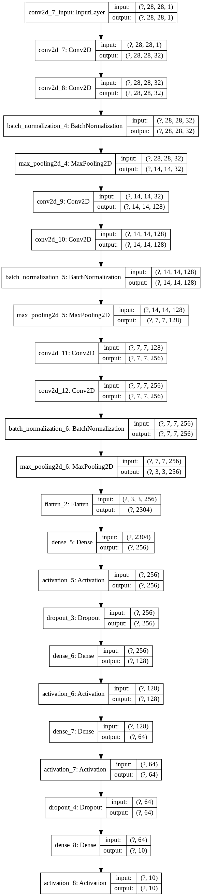

# MNIST-Digit-Recognition
The project is pretty simple and everyone has done the project, but this particular kernel is been uploaded because of its accuracy!
# Result
I have achieved an accuracy of **99.27%**.
# Model Building
For this project I have used an exsisting model of mine, so in the main file I just loaded the model and showed the accuracy.
The Model Architechture is given below:

